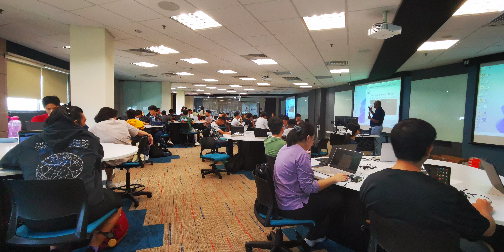

During the Monash University Foundation Year (MUFY) Immersion Day, the team conducted a workshop to teach foundation year students interested in technology how to control drones using the Python programming language.
